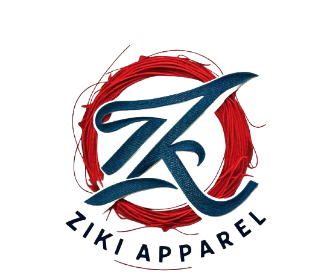

# Ziki Apparel - Ecommerce Website

A full-featured ecommerce website for denim and apparel built with Next.js, Node.js, and PostgreSQL.



## 🚀 Features

- 🛒 **Complete Ecommerce Functionality**
  - Product catalog with categories and variants
  - Shopping cart with real-time updates and badge notifications
  - Secure checkout process with multiple payment options
  - Order management and tracking system

- 🔐 **Authentication & Authorization**
  - User registration and login with NextAuth.js
  - Role-based access (Customer/Admin)
  - Protected routes and API endpoints
  - Secure session management

- 📧 **Email Notifications**
  - Automated order confirmation emails
  - Order status update notifications
  - Professional HTML email templates
  - Support for multiple email providers

- 🎨 **Modern UI/UX**
  - Responsive design with Tailwind CSS
  - Video hero banner with interactive slider
  - Professional branding and layout
  - Mobile-optimized interface

- 👨‍💼 **Admin Dashboard**
  - Complete order management system
  - Product inventory management
  - Customer support tools
  - Sales analytics and reporting

- 🎬 **Rich Media Support**
  - Video hero banners with autoplay
  - Image optimization with Next.js
  - Multi-image product galleries
  - Logo and branding integration

## 🛠️ Tech Stack

- **Frontend**: Next.js 13, TypeScript, Tailwind CSS
- **Backend**: Node.js, Next.js API Routes
- **Database**: PostgreSQL/SQLite with Prisma ORM
- **Authentication**: NextAuth.js with JWT
- **Email**: Nodemailer with HTML templates
- **Payments**: Stripe integration ready + Cash on Delivery
- **UI Components**: Custom components with Tailwind
- **Image Handling**: Next.js Image optimization
- **Forms**: React Hook Form with Zod validation

## 📋 Getting Started

### Prerequisites

- Node.js 18+ 
- Git
- Database (PostgreSQL recommended for production, SQLite for development)

### Installation

1. **Clone the repository**
   ```bash
   git clone https://github.com/FizaWaseem/ziki-apparel.git
   cd ziki-apparel
   ```

2. **Install dependencies**
   ```bash
   npm install
   ```

3. **Set up environment variables**
   ```bash
   cp .env.example .env.local
   ```
   
   Edit `.env.local` with your configuration:
   ```env
   DATABASE_URL="file:./dev.db"
   NEXTAUTH_URL="http://localhost:3000"
   NEXTAUTH_SECRET="your-secret-key"
   EMAIL_HOST="smtp.gmail.com"
   EMAIL_PORT="587"
   EMAIL_USER="your-email@gmail.com"
   EMAIL_PASS="your-app-password"
   EMAIL_FROM="noreply@zikiapparel.com"
   EMAIL_FROM_NAME="Ziki Apparel"
   ```

4. **Set up the database**
   ```bash
   npx prisma db push
   npx prisma generate
   npm run seed
   ```

5. **Run the development server**
   ```bash
   npm run dev
   ```

6. **Open your browser**
   
   Visit [http://localhost:3000](http://localhost:3000) to see your Ziki Apparel store!

## 🗄️ Database Schema

The application includes a comprehensive database schema with:

- **Users**: Customer and admin accounts with authentication
- **Products**: Complete product catalog with variants and images
- **Categories**: Product categorization system
- **Cart**: Shopping cart functionality with session persistence
- **Orders**: Order management with status tracking
- **Reviews**: Product review and rating system

## 🎯 Default Accounts

After running the seed script, you can login with:

**Admin Account:**
- Email: `admin@zikiapparel.com`
- Password: `admin123`

**Customer Account:**
- Email: `customer@example.com`
- Password: `customer123`

## 📁 Project Structure

```
ziki-apparel/
├── src/
│   ├── components/         # Reusable UI components
│   │   └── Layout.tsx     # Main layout with header/footer
│   ├── contexts/          # React contexts
│   │   └── CartContext.tsx # Global cart state management
│   ├── pages/             # Next.js pages and API routes
│   │   ├── api/           # Backend API endpoints
│   │   ├── auth/          # Authentication pages
│   │   ├── products/      # Product catalog pages
│   │   ├── admin/         # Admin dashboard
│   │   └── orders/        # Order management
│   ├── styles/            # Global styles and Tailwind config
│   └── utils/             # Utility functions and services
├── prisma/                # Database schema and migrations
│   ├── schema.prisma      # Database schema definition
│   └── seed.ts           # Database seeding script
├── public/                # Static assets
│   ├── images/           # Product and hero images
│   ├── videos/           # Hero banner videos
│   └── ziki-apparel-logo.png # Brand logo
└── docs/                  # Documentation
```

## 🚀 Deployment

### Quick Deploy Options

1. **Vercel (Recommended)**
   ```bash
   npm i -g vercel
   vercel
   ```

2. **AWS Amplify**
   - Connect GitHub repository
   - Add environment variables
   - Deploy automatically

3. **Traditional Hosting**
   ```bash
   npm run build
   npm start
   ```

For detailed deployment instructions, see [DEPLOYMENT.md](DEPLOYMENT.md).

## 🔧 Available Scripts

```bash
npm run dev          # Start development server
npm run build        # Build for production
npm run start        # Start production server
npm run lint         # Run ESLint
npm run seed         # Seed database with sample data
npx prisma studio    # Open Prisma database studio
npx prisma generate  # Generate Prisma client
```

## 🌟 Key Features Walkthrough

### 🛒 Shopping Experience
1. **Browse Products**: Responsive product catalog with filtering
2. **Product Details**: Detailed product pages with image galleries
3. **Add to Cart**: Real-time cart updates with badge notifications
4. **Checkout**: Secure multi-step checkout process
5. **Order Tracking**: Complete order history and status tracking

### 👨‍💼 Admin Features
1. **Order Management**: View and update all customer orders
2. **Email Notifications**: Automatic email sending for order updates
3. **Product Management**: (Ready for implementation)
4. **Analytics**: Order and sales reporting

### 🎨 Design Features
1. **Video Hero**: Engaging video banner with navigation slider
2. **Responsive Layout**: Perfect on desktop, tablet, and mobile
3. **Professional Branding**: Custom logo and Ziki Apparel theming
4. **Modern UI**: Clean, professional ecommerce design

## 🤝 Contributing

1. Fork the repository
2. Create your feature branch (`git checkout -b feature/AmazingFeature`)
3. Commit your changes (`git commit -m 'Add some AmazingFeature'`)
4. Push to the branch (`git push origin feature/AmazingFeature`)
5. Open a Pull Request

## 📝 License

This project is licensed under the MIT License - see the [LICENSE](LICENSE) file for details.

## 🙋‍♀️ Author

**Fiza Waseem**
- GitHub: [@FizaWaseem](https://github.com/FizaWaseem)
- Project: [Ziki Apparel](https://github.com/FizaWaseem/ziki-apparel)

## 🆘 Support

If you encounter any issues or have questions:

1. Check the [Issues](https://github.com/FizaWaseem/ziki-apparel/issues) section
2. Create a new issue with detailed information
3. Contact the development team

---

**Built with ❤️ for the fashion industry**
